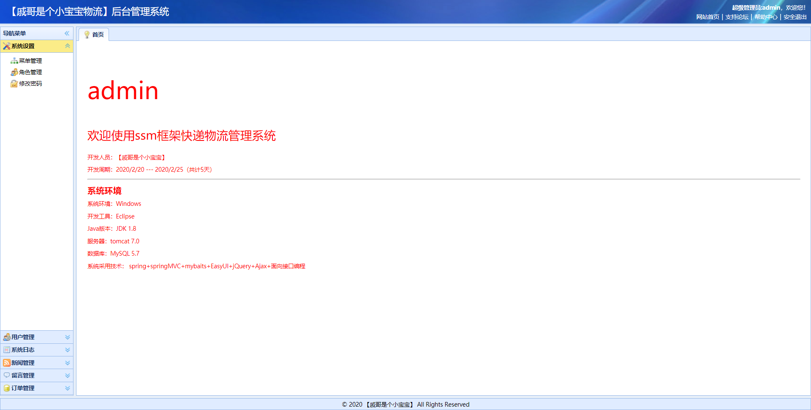

## 基于JSP的物流管理系统

- <b>完整代码获取地址：从戎源码网 ([https://armycodes.com/](https://armycodes.com/))</b>
- <b>技术探讨、资料分享，请加QQ群：692619798</b> 
- <b>作者微信：19941326836  QQ：952045282</b> 
- <b>承接计算机毕业设计、Java毕业设计、Python毕业设计、深度学习、机器学习</b>
- <b>选题+开题报告+任务书+程序定制+安装调试+论文+答辩ppt 一条龙服务</b>
- <b>所有选题地址 ([https://github.com/YuLin-Coder/AllProjectCatalog](https://github.com/YuLin-Coder/AllProjectCatalog)) </b>

## 项目介绍
基于JSP的物流管理系统，该值班物流管理系统具有以下功能：

用户功能：
1. 注册登录功能：用户可以通过注册账号并登录系统。
2. 快递在线下单功能：用户可以在线上提交快递下单请求。
3. 查询订单功能：用户可以查询已下单的订单状态和详细信息。
4. 新闻资讯功能：用户可以浏览最新的物流行业新闻和资讯。
5. 业务范围介绍功能：用户可以了解该物流公司的业务范围和服务内容。

管理员功能：
1. 菜单管理功能：管理员可以对系统菜单进行管理，包括添加、编辑和删除菜单。
2. 角色管理功能：管理员可以创建和管理用户角色，并设置各个角色的权限。
3. 用户管理功能：管理员可以管理系统中的所有用户，包括添加、编辑、删除。
4. 新闻管理功能：管理员可以发布、编辑和删除新闻资讯。
5. 订单发货管理功能：管理员可以查看和处理用户提交的快递订单，包括确认发货、更新状态等。
6. 留言管理功能：管理员可以查看和回复用户留言，并进行留言的管理和筛选。

## 项目技术
- 编程语言：Java
- 数据库：MySQL
- 前端技术：JSP、JavaScript、jquery
- 后端技术：Spring、SpringMVC、MyBatis

## 运行环境
- JDK版本：JDK1.8及以上
- 开发工具：IDEA、Ecplise、Myecplise都可以
- 数据库: MySQL5.7及以上

## 运行截图

